# Next Full-Stack Social Media 2024

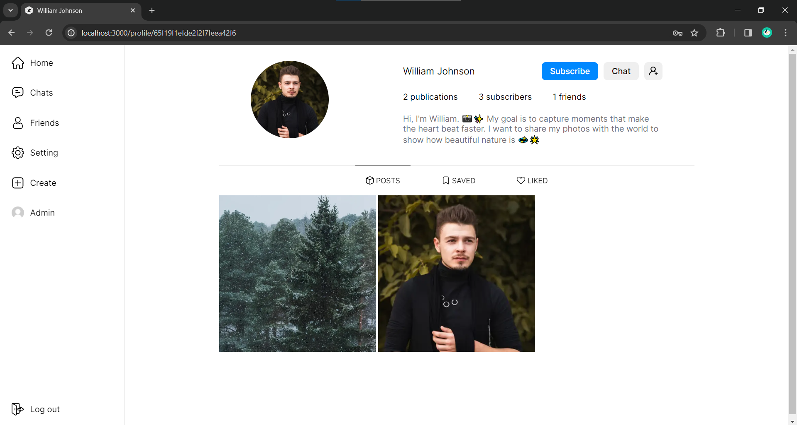

**Technology Stack**

> Client

<ul>
  <li>💎 Next.js</li>
  <li>💾 Redux toolkit</li>
  <li>⚡ SWR</li>
  <li>🔍 Axios</li>
  <li>📞 Socket.io-client</li>
  <li>✨ React-hook-form</li>
</ul>

> Server

<ul>
  <li>🧱 Express</li>
  <li>🔑 JWT</li>
  <li>💾 MongoDB</li>
  <li>📞 Socket.io</li>
</ul>

> Testing

<ul>
  <li>✅ Cypress</li>
</ul>

## Site Functional

<ul>
  <li>Registration/Authorization</li>
  <li>View a feed of recommendations with unique content collected for the user</li>
  <li>Add/Remove from friends</li>
  <li>Subscribe/Unsubscribe from users</li>
  <li>Create your own posts</li>
  <li>Mark posts as liked and add to favorites</li>
  <li>Remove from favorites and unlike</li>
  <li>Pagination of the feed of posts, posts in the user profile</li>
  <li>Create a comment, delete, like and dislike</li>
  <li>Share not only photos but also videos</li>
  <li>Search for friends</li>
  <li>Create chats with another user</li>
  <li>Receive messages from users through the notification shade</li>
  <li>Change your account details</li>
  <li>Automatic deletion of data (pictures, videos) when deleting a user or posts</li>
  <li>Log out of your account</li>
</ul>

**Security**

<p>The project uses the "bcrypt" library, which encrypts the data before sending it to the database, and also uses JWT.</p>

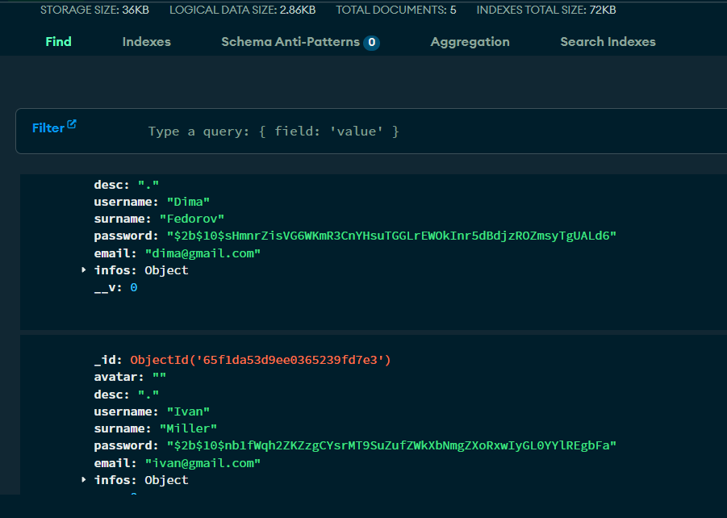

## Project gallery "PC version"


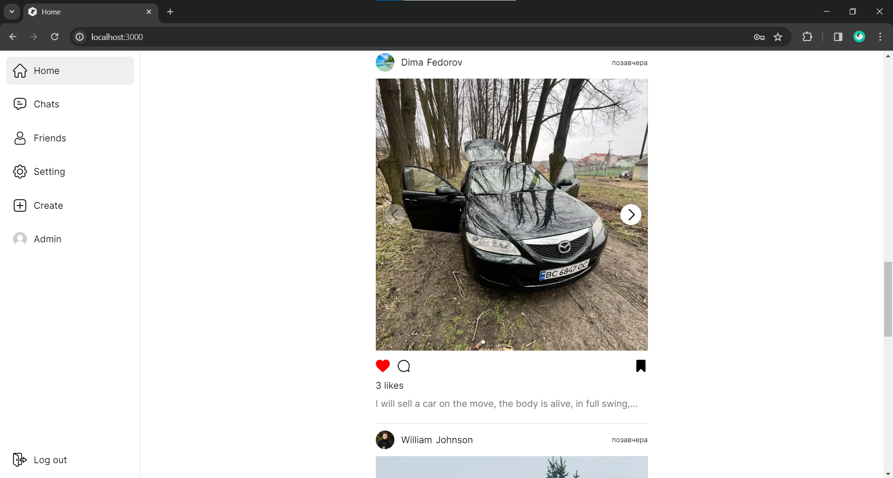

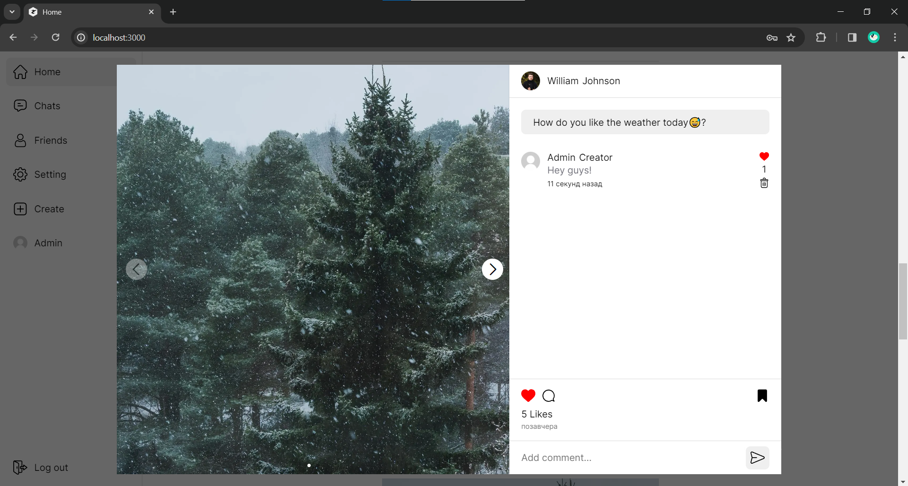


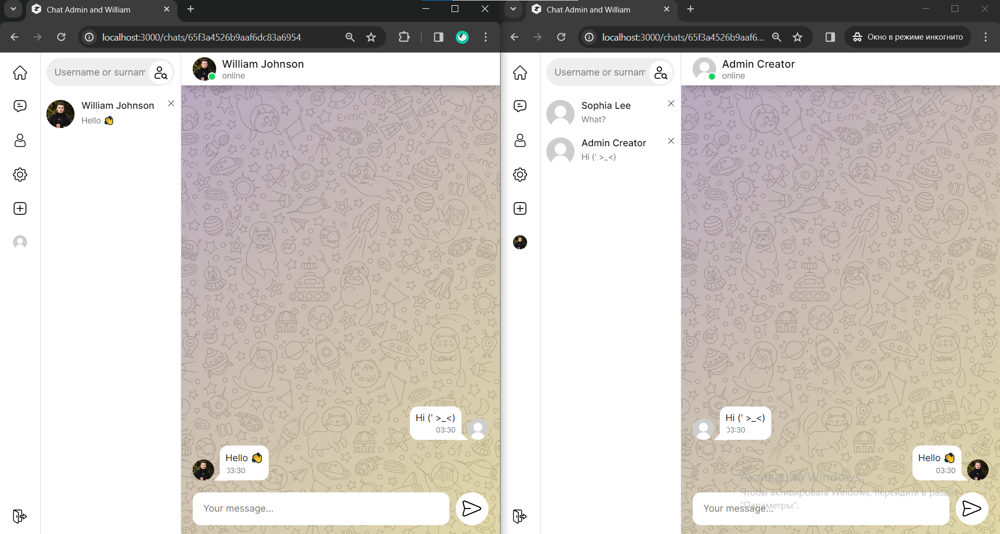

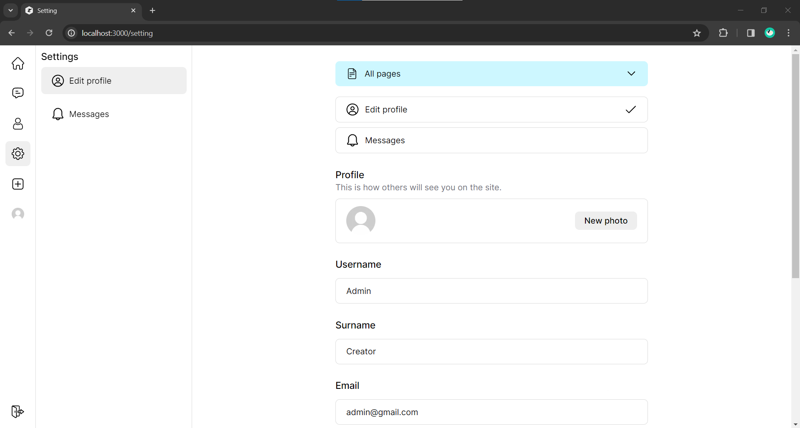

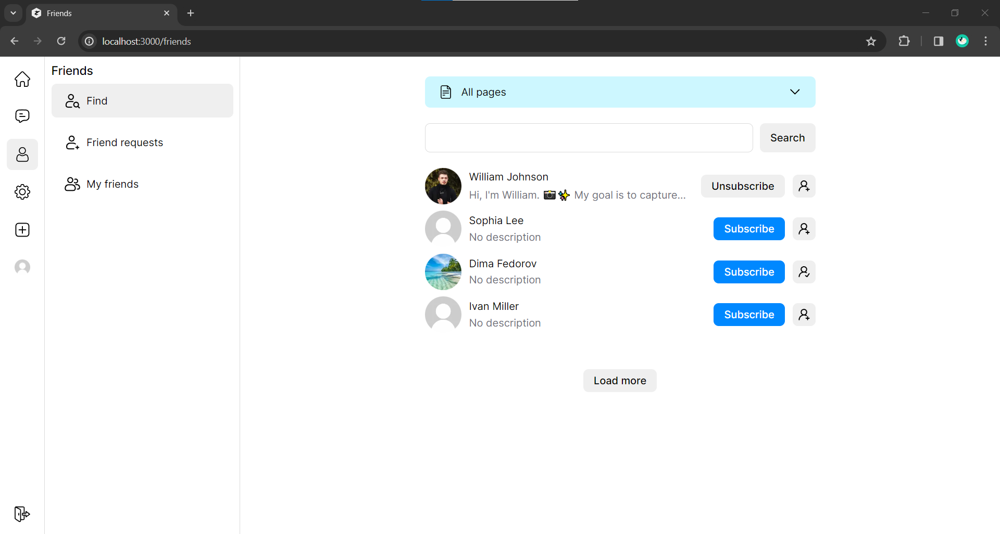

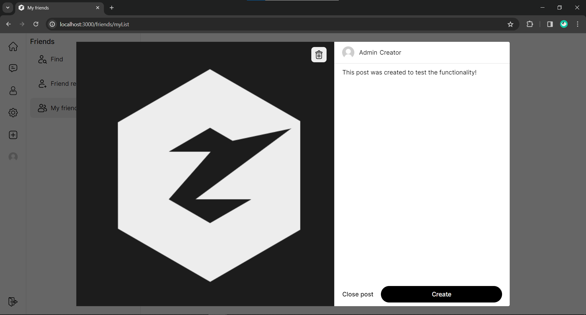

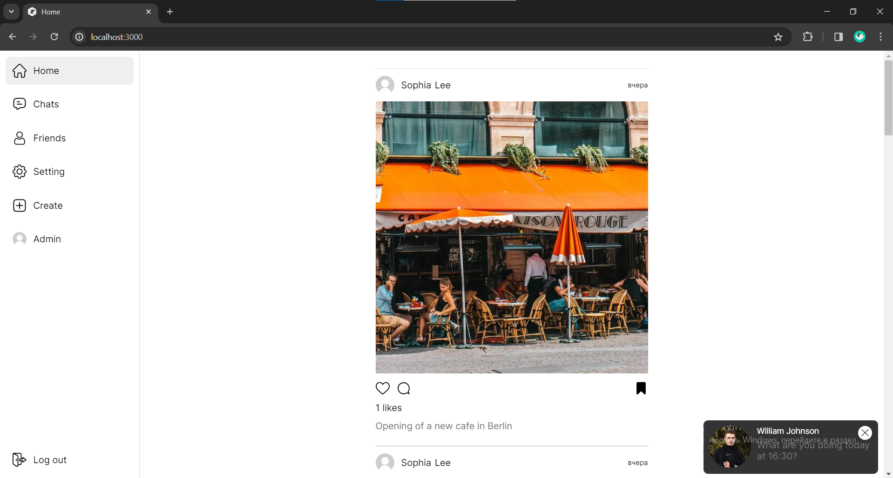

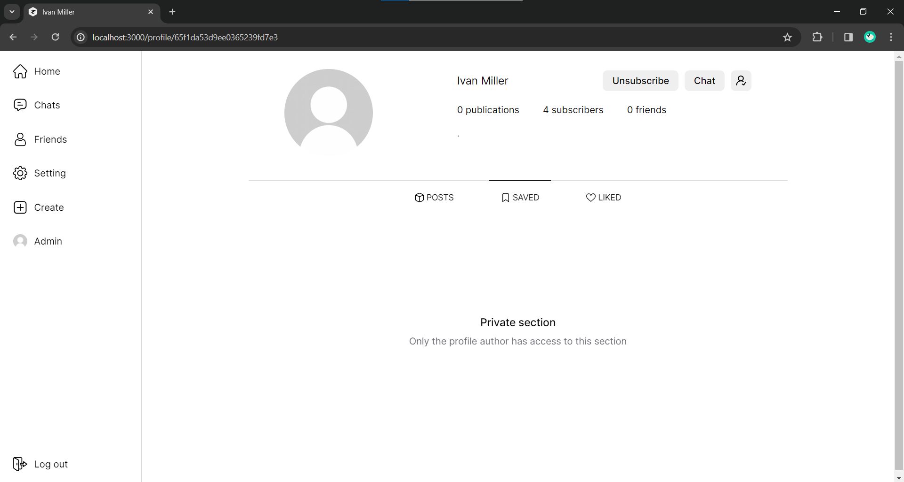

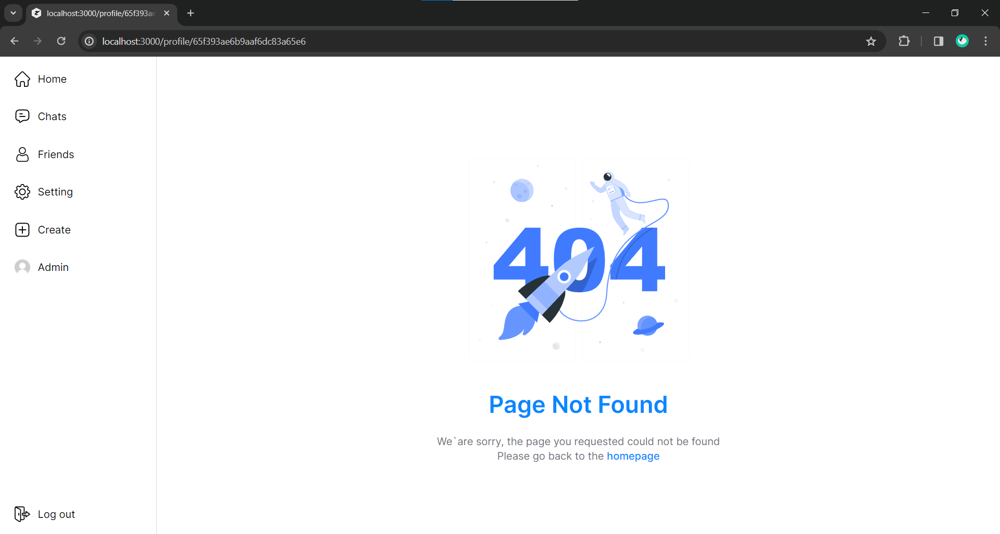

## Project gallery "Mobile version"

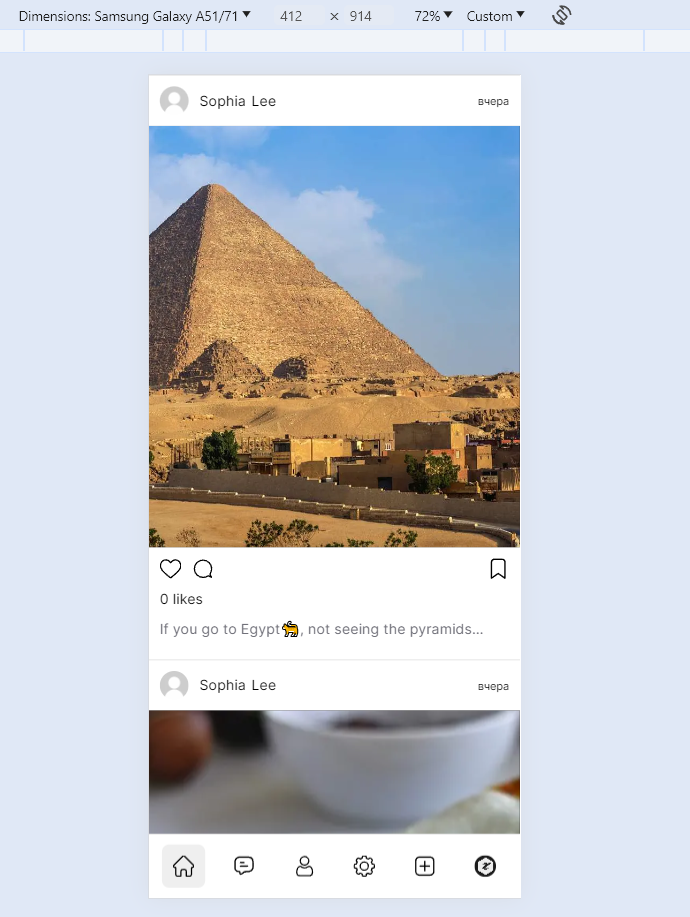

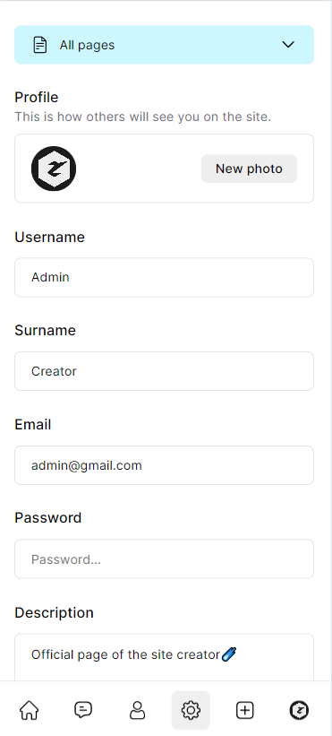

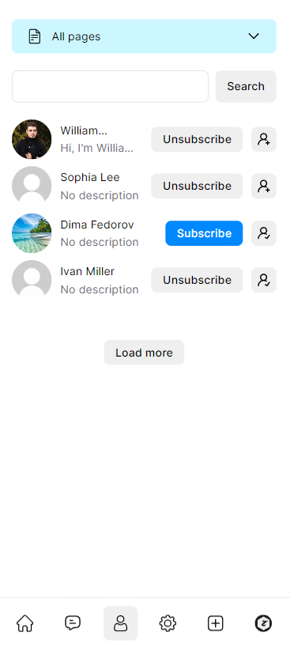

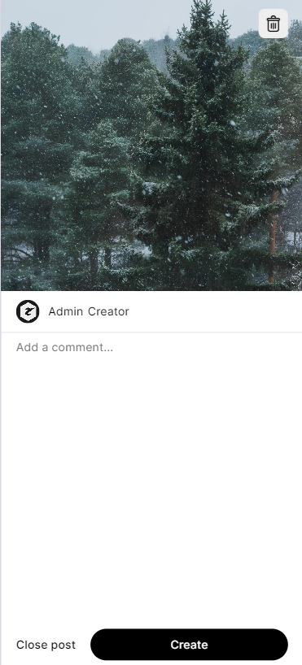

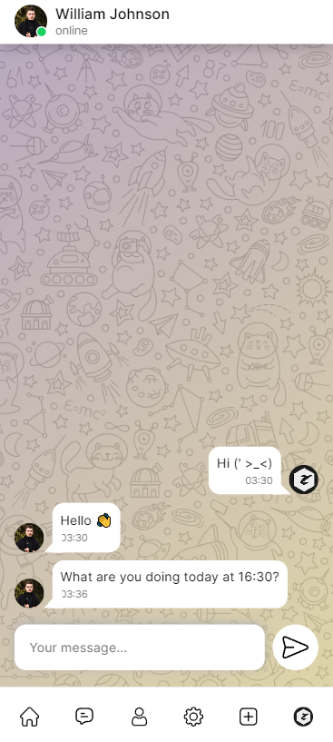

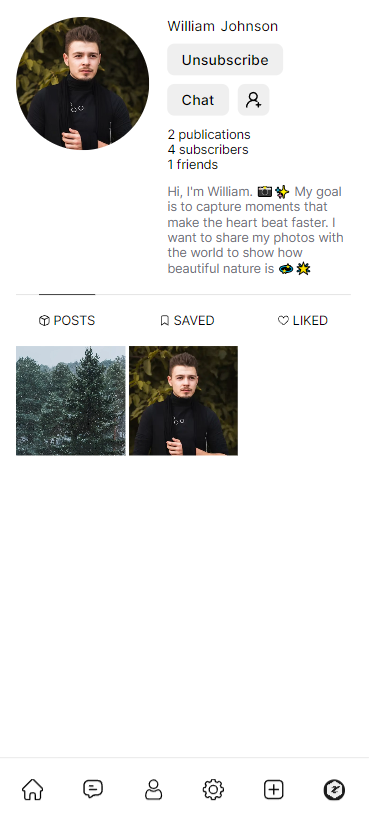

## Getting Started

You can just fork or clone this repository and use it as is.

✨ It just works. ✨

### Configure

Open the .env file and replace the data with yours (ATTENTION! The .env file can be found on both the client and the server)

### Start the project

```bash

npm i

cd client
npm run dev

cd server
npm run dev

```

**Important**

<p>When receiving a message from socket paths, the message may be duplicated, this happens due to the "Strict mode" enabled in the project settings. To disable it, go to the "next.config.mjs" file and add the reactStrictMode field to it: false</p>

```js
/** @type {import('next').NextConfig} */
const nextConfig = {
  env: {
    clientUrl: 'http://localhost:3000',
    serverUrl: 'http://localhost:8080/',
  },
  images: {
    remotePatterns: [{ hostname: 'localhost' }],
  },
  reactStrictMode: false,
}

export default nextConfig
```
